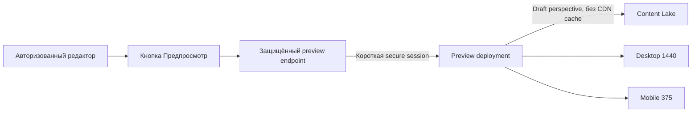
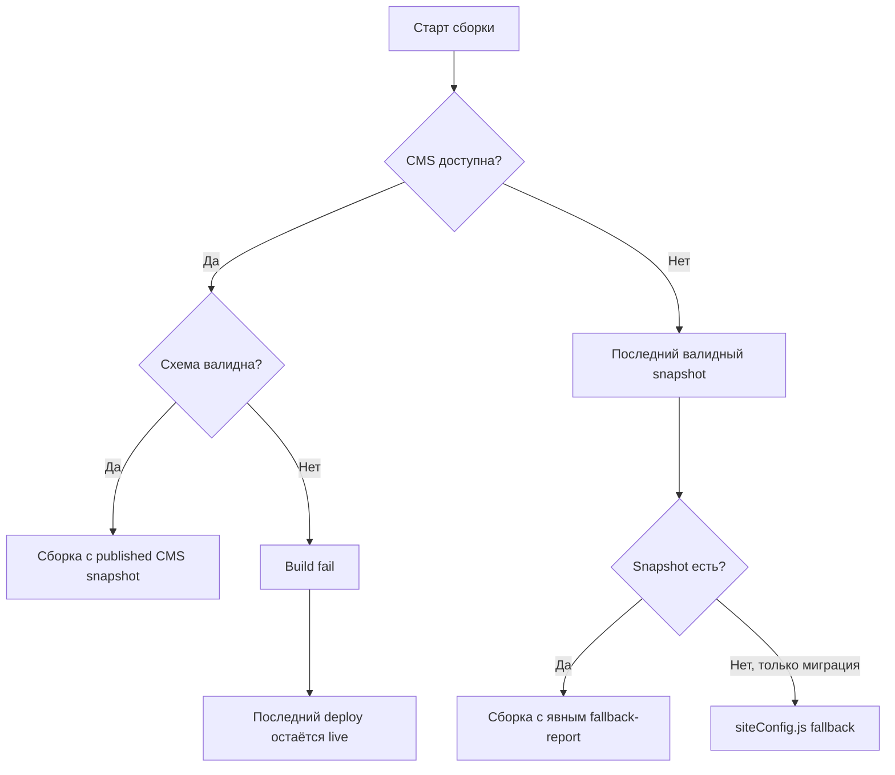

# Архитектура CMS для Speaker One

Статус: архитектурное решение Stage 10A, без интеграции CMS.  
Дата проверки решений и тарифов: 15 июля 2026 года.  
Основная рекомендация: Sanity с получением контента во время сборки.  
Запасной вариант: Decap CMS с Git-based редакционным процессом.

## 1. Цель и границы решения

CMS должна позволить владельцу без навыков программирования управлять существующим лендингом Speaker One: текстами, ссылками, изображениями, SEO, реквизитами, формой и Speech Lab. При этом публичное приложение React/Vite, порядок секций, якоря, дизайн, GSAP-анимация, механика Speech Lab и отправка формы сохраняются.

Stage 10A не включает:

- подключение CMS и создание рабочей админ-панели;
- перенос данных из `siteConfig.js`;
- изменение runtime, публичного bundle или компонентов;
- изменение `package.json` и установку зависимостей;
- создание page builder, блога, CRM, аналитики или AI-инструментов;
- хранение паролей, write-токенов, токенов Telegram-бота и других секретов во фронтенде.

Интеграция начинается только после утверждения владельцем CMS, бюджета, хостинга, ролей и процесса публикации.

## 2. Текущее состояние проекта

Проект уже имеет хорошую основу контентной модели:

- `src/config/siteConfig.js` хранит видимые тексты, навигацию, пути к медиа, внешние ссылки, реквизиты, Hero, философию, карточки результатов, данные эксперта, этапы, Speech Lab и Footer;
- `src/config/seoConfig.js` централизует домен, SEO, Open Graph, JSON-LD, robots, sitemap и manifest;
- `src/services/submitLead.js` получает `VITE_LEAD_ENDPOINT` из окружения и не хранит серверные секреты;
- компоненты используют стабильные props, секции и якоря;
- текущие медиа лежат в `public/`;
- сайт собирается Vite как статический frontend.

Основной дефицит текущего подхода — не структура данных, а отсутствие защищённой редакторской среды, draft/publish, формальной валидации, истории, управления медиа и отката.

## 3. Что должно редактироваться

| Категория | Данные | Рекомендуемый доступ |
| --- | --- | --- |
| Тексты | Тексты секций, подписи, CTA, сообщения формы и Speech Lab | Admin, Editor |
| Ссылки | Якоря, портфолио, политика, проверенные соцсети | Admin, Editor; якоря только из allow-list |
| Изображения | Hero, эксперт, философия, рабочие фото, логотип, favicon, OG | Admin, Editor |
| SEO | Title, description, домен, OG и проверяемые поля structured data | Admin; Editor — тексты SEO и OG |
| Юридические данные | Владелец, ИНН, ОГРНИП, политика | Admin |
| Форма | Видимые тексты, сообщения, безопасные ограничения длины | Admin — ограничения; Editor — тексты |
| Доставка заявок | Публичный URL серверного endpoint и source | Admin; HTTPS и allow-list хоста |
| Speech Lab | Вступление, вопросы, ответы, веса, результаты, рекомендации, CTA | Admin, Editor; веса и пороги — Admin |
| Навигация | Подписи, ссылки, видимость, порядок пунктов, CTA | Admin, Editor; порядок секций не меняется |
| Контакты | Telegram и проверенные социальные ссылки | Admin, Editor |
| Системные настройки | Имя сайта, язык, домен, webhook, dataset | Admin |
| Фоновые эффекты | Только одобренные пресеты в будущем, без свободного CSS | На первом этапе заблокировано |

Полный каталог полей описан в `CMS_CONTENT_MODEL.md`.

## 4. Архитектурные принципы

1. **Публичный сайт остаётся статическим.** Недоступность CMS не должна выключать уже опубликованный сайт.
2. **В production попадает только published-контент.** Черновики не участвуют в production-сборке.
3. **Компоненты не зависят от CMS.** Адаптер приводит данные к текущей форме `CONFIG_CMS`.
4. **Fallback сохраняется до полного приёмочного тестирования.** Текущий конфиг и последняя валидная выгрузка доступны для восстановления.
5. **Публичной записи в CMS нет.** В браузере нет write-токена.
6. **Минимальные права.** Редактор не должен управлять endpoint, доменом, реквизитами, ролями и безопасностью.
7. **Ошибка блокирует публикацию.** Невалидный контент не заменяет последнюю рабочую версию сайта.
8. **Миграция обратима.** Регулярный JSON/NDJSON-экспорт снижает vendor lock-in.

## 5. Сравнение CMS

Цены и возможности ниже сверены с официальными страницами 15 июля 2026 года. Они могут измениться. Налоги, домен, frontend-хостинг, поддержка разработчика и конвертация валюты не включены, если не указано обратное.

### 5.1 Сводная таблица

| Критерий | Decap CMS | Sanity | Strapi | Directus | Supabase + своя админка | Payload CMS |
| --- | --- | --- | --- | --- | --- | --- |
| Сложность внедрения | Средняя | Средняя | Высокая | Высокая | Очень высокая | Высокая |
| Базовая стоимость | $0, open source | Free $0; Growth $15 за non-viewer seat/мес. | Community $0; Growth CMS $15/seat/мес. | Core $0 в пределах лимитов; важны условия лицензии/grant | Free $0; Pro от $25/мес. | Open source при self-host; инфраструктура отдельно |
| Отдельный сервер | CMS-сервер не нужен; нужен Git и OAuth-путь | Не нужен: Content Lake и Studio управляются провайдером | Нужен при self-host; есть Cloud | Нужен при self-host; Cloud — отдельная услуга | База/Auth управляются, но админку и secure functions нужно размещать | Нужны приложение, БД и постоянное хранилище медиа |
| Удобство владельцу | Хорошее после настройки, но Git иногда виден | Очень хорошее при качественной схеме Studio | Хорошее, но система и эксплуатация тяжелее | Хороший data-интерфейс, много технических понятий | Ровно настолько хорошее, насколько качественно его разработали | Хорошее после настройки, но техническое владение остаётся сложным |
| Изображения | Файлы в репозитории; оптимизацию нужно строить в CI | Asset CDN, metadata, crop, трансформации | Media Library; storage/оптимизация настраиваются | File Library; трансформации зависят от конфигурации | Storage есть, весь UX медиа нужно разрабатывать | Upload collections; нужен storage adapter |
| Авторизация | Git provider/OAuth или Git Gateway | Управляемые аккаунты; точечные custom roles только Enterprise | Встроенная; SSO платный/add-on | Встроенная, granular policies/RBAC | Supabase Auth + собственная авторизация панели | Встроенная auth-коллекция и access control в коде |
| Предпросмотр | Deploy Preview и preview templates | Presentation/Live Preview; для Vite нужна безопасная интеграция | Static Preview бесплатен; Live Preview зависит от тарифа/настройки | Preview URL и flows настраиваются | Полностью разрабатывается самостоятельно | Есть Preview/Live Preview primitives |
| Draft/publish | Editorial Workflow создаёт ветки и PR | Нативные drafts; scheduled drafts на Growth | Нативный Draft & Publish | Versions/revisions и flows | Статусы и workflow нужно строить | Нативные drafts, autosave, scheduled publish |
| История | Git history | Review drafts: 3 дня Free, 90 дней Growth; полный audit — Enterprise | Content History платный: 30 дней Growth | Core указывает 30 дней revisions/activity | Нужно проектировать audit-таблицы | Нативные versions с настраиваемой глубиной |
| Откат | Git revert/откат PR | В пределах доступной истории; rollback releases — Enterprise | Через Content History на подходящем тарифе | Восстановление revisions в пределах retention | Нужно реализовать и протестировать | Восстановление версий документов/globals |
| Совместимость с React/Vite | Отличная | Отличная через build-time API | Хорошая через REST/GraphQL | Хорошая через REST/GraphQL | Хорошая API-совместимость, но большой объём разработки | Хорошая API-совместимость, но сама CMS — отдельный Next.js-сервис |
| Масштабирование до блога | Хорошее для небольшого/среднего объёма | Отличное | Отличное | Отличное | Возможно, но это новая разработка | Отличное |
| Vendor lock-in | Низкий, контент в Git | Средний: GROQ, dataset и asset refs специфичны | Низкий/средний при self-host | Низкий/средний | Средний без CMS-neutral адаптера | Низкий/средний, остаётся framework coupling |
| Поддержка | Низкая/средняя: OAuth и CI требуют контроля | Низкая | Высокая self-host, средняя Cloud | Высокая self-host, средняя Cloud | Высокая: это свой продукт | Высокая: приложение, БД, storage, обновления |
| Для владельца из РФ | Русские подписи просты; нужно проверить Git/OAuth-сервис | Русские поля просты; до покупки проверить аккаунт, оплату и доступность | Self-host снижает cloud-зависимость, но требует эксплуатации | Self-host даёт контроль, но требует специалиста | Можно гибко разместить и полностью русифицировать, но дорого разработать | Self-host даёт контроль, локализация требует разработки |
| Работа без программиста | Да после настройки; проблемы auth/CI требуют специалиста | Да для ежедневного редактирования | Да для контента; сервер обслуживает специалист | Да для контента; БД/сервер обслуживает специалист | Только после создания полноценного продукта | Да для контента; платформу обслуживает разработчик |
| Важный лимит бесплатного варианта | Нет native roles и автооптимизации; репозиторий растёт | Free: только Admin/Viewer, 3 дня review, публичные datasets | Community без Content History | Core: 3 seats, 25 collections, 30 дней истории; проверить право на лицензию/grant | Free-проекты останавливаются после недели неактивности; CMS-workflow отсутствует | Полный production stack требует платной инфраструктуры |
| Сложность публикации | Средняя: merge запускает deploy | Низкая/средняя: publish запускает webhook | Средняя/высокая | Средняя/высокая | Высокая | Высокая |

### 5.2 Разбор вариантов

#### Decap CMS

- **Плюсы:** нет платы за CMS; контент и история остаются в Git; естественная статическая пересборка; низкий lock-in; editorial workflow использует ветки и pull requests; поддерживаются deploy preview.
- **Минусы:** авторизация зависит от Git backend/OAuth; роли связаны с правами репозитория; оптимизация изображений не автоматическая; бинарные файлы увеличивают репозиторий; откат надёжен, но иногда требует понимания Git.
- **Стоимость:** программное обеспечение $0. Возможны расходы на хостинг/OAuth-функцию и поддержку.
- **Вывод:** сильный запасной вариант, если важнее нулевая лицензия и переносимость, чем самый удобный редакторский UX.

#### Sanity

- **Плюсы:** hosted structured content и assets, настраиваемая Studio, schema validation, drafts, совместная работа, image CDN, preview tooling, webhooks, удобный build-time API.
- **Минусы:** средний vendor lock-in. Free даёт только Administrator и Viewer. Growth добавляет Editor и Contributor, но они работают со всеми datasets проекта: Contributor ограничен черновиками, Editor может публиковать. Ограничения по типам документов/полям требуют Enterprise custom roles или отдельного защищённого контура. Полный audit и release rollback также относятся к Enterprise.
- **Стоимость:** Free — $0, до 20 seats, 10 000 документов, 100 ГБ assets и Live Preview по текущей таблице. Growth — $15 за каждого non-viewer пользователя в месяц и 90 дней review. Admin + ещё один активный редактор — ориентировочно $30/мес. до налогов.
- **Вывод:** лучший баланс для Speaker One при приоритете удобной панели, медиа, небольшого объёма эксплуатации и будущего блога.

#### Strapi

- **Плюсы:** зрелая модель данных, REST/GraphQL, Draft & Publish, custom roles в Community, большая экосистема, контроль при self-host.
- **Минусы:** production Node-сервис, БД, storage, monitoring, обновления и backup нужно обслуживать. Hosting и расширенные редакторские функции оплачиваются отдельно.
- **Стоимость:** Community можно self-host без платы за лицензию. Strapi Cloud начинается от $35/project/мес.; Starter не указывает backup, Pro — $90/project/мес. с weekly/manual backup. Growth CMS — $15/seat/мес. и 30 дней Content History.
- **Вывод:** для редко редактируемого одностраничного сайта сейчас избыточен.

#### Directus

- **Плюсы:** развитый data studio, granular RBAC/policies, файлы, revisions, гибкий API, контроль при self-host.
- **Минусы:** при self-host владелец отвечает за сервис и БД; нужно проверить лицензионные условия/grant; после Core ценовой шаг большой.
- **Стоимость:** текущий Core — $0, 3 seats, 25 collections и 30 дней history. Официальная страница указывает Cloud add-on $99/мес. для Core/Grant; Team — $499/мес. при годовой оплате или $599 помесячно. Для подходящих небольших организаций доступна заявка на Open Innovation Grant.
- **Вывод:** разумная self-host альтернатива при приоритете независимости, но тяжелее в эксплуатации.

#### Supabase + собственная админка

- **Плюсы:** Postgres, Auth, Storage, RLS и API дают надёжную backend-основу; интерфейс и workflow можно сделать полностью по требованиям; данные переносимы.
- **Минусы:** это не CMS. Нужно самостоятельно разработать все поля, media picker, draft/publish, историю, preview, роли, audit, import/export и защиту публикации.
- **Стоимость:** Free — $0, 500 МБ БД, 1 ГБ файлов, два active projects; неактивный Free-проект ставится на паузу через неделю. Pro — от $25/мес., с daily backups на 7 дней. Главная стоимость — разработка и поддержка.
- **Вывод:** неоправданный объём собственного продукта для текущего сайта.

#### Payload CMS

- **Плюсы:** схемы принадлежат проекту, встроены admin, auth, granular access, versions, drafts, autosave, preview/live preview и uploads.
- **Минусы:** отдельное Next.js-приложение требует БД, постоянного object storage, email, безопасного deploy, обновлений и backup. Это второй application stack рядом с Vite.
- **Стоимость:** self-host версия open source; итог — стоимость приложения, Postgres/MongoDB, object storage, CDN, почты и резервного копирования. Managed Cloud нужно заново оценить на момент внедрения.
- **Вывод:** технически сильный, но эксплуатационно избыточный вариант.

## 6. Рекомендация

### Основной вариант: Sanity с заранее выбранной моделью ролей

Sanity рекомендуется, потому что:

- публичный React/Vite-сайт остаётся статическим;
- владелец получает отдельную Studio с русскими подписями и подсказками;
- изображения хранятся вне Git и отдаются через image CDN;
- drafts, preview, schema validation и publish — штатные сущности;
- webhook запускает сборку только после явной публикации;
- владельцу не нужно обслуживать CMS-сервер, БД и media server;
- ту же модель можно расширить блогом без замены frontend.

Безопасные варианты использования:

- **один владелец:** Sanity Free, владелец — Administrator, дополнительные пользователи — Viewer;
- **небольшая команда:** Growth, владелец — Administrator, бизнес-роль «Editor» отображается на Sanity Contributor и готовит только drafts, Admin проверяет и публикует; системные настройки находятся вне общего content project либо в отдельном Admin-only project;
- **точные granular roles в одном проекте:** Enterprise custom roles; для текущего сайта это, вероятно, несоразмерно по цене.

Встроенный Growth Editor нельзя выдавать человеку, которого нужно технически ограничить от изменения и публикации системных документов в том же проекте.

Перед покупкой владелец должен проверить регистрацию, MFA, оплату, доступность сервиса из нужной страны и приемлемость указанного ограничения ролей.

### Запасной вариант: Decap CMS

Decap следует выбрать, если важнее минимальная ежемесячная стоимость и низкий lock-in. Он сохраняет статический build и сильную Git-историю, но требует защищённого OAuth, CI preview и отдельной оптимизации изображений. Для владельца без технического опыта Git-конфликты и auth-сбои могут быть менее удобны.

### Почему остальные варианты не рекомендуются первыми

Strapi, Directus и Payload требуют постоянной эксплуатации приложения, БД и медиа. Supabase означает разработку самой CMS. Для редких изменений одного лендинга это не даёт достаточной пользы.

## 7. Рекомендуемый поток данных

### 7.1 Production

```mermaid
flowchart LR
  A["Sanity Studio<br/>Admin или Contributor"] -->|"Сохранить draft"| B["Content Lake<br/>draft + published"]
  A -->|"Явно опубликовать"| B
  B -->|"Подписанный webhook"| C["CI хостинга<br/>fetch + validate"]
  C -->|"Только published"| D["CMS-neutral адаптер"]
  D --> E["Валидный snapshot<br/>формы CONFIG_CMS"]
  E --> F["Vite static build"]
  F -->|"Atomic deploy"| G["CDN / публичный сайт"]
```

Контент хранится в Content Lake, изображения — в Sanity Assets. Production-сборка получает только published-данные, проверяет их, переводит в текущую модель и создаёт статический сайт. Если fetch, валидация или build не прошли, последняя рабочая публикация остаётся онлайн.

### 7.2 Preview

Preview не индексируется, не появляется в навигации и требует авторизацию. Draft read token не попадает в публичный Vite bundle. На первом внедрении безопаснее использовать защищённый preview build/endpoint, а полный click-to-edit добавить после стабилизации адаптера. Переписывать сайт на Next.js или SSR не требуется.

### 7.3 Fallback

Порядок fallback на время миграции:

1. свежий published CMS-контент;
2. последняя валидная CMS-выгрузка;
3. текущий `siteConfig.js`, пока включён migration flag;
4. отказ сборки без замены production.

Уже опубликованный сайт не делает runtime-запросов в CMS и продолжает работать при её сбое.

## 8. Пересборка против runtime API

| Критерий | CMS → webhook → rebuild/deploy | CMS → runtime API → React |
| --- | --- | --- |
| Доступность | После deploy не зависит от CMS | Контент может не загрузиться при сбое API |
| Скорость | Статика с CDN | Дополнительный запрос и loading/error states |
| SEO | Контент участвует в build и meta-generation | Для SPA нужна дополнительная гарантия видимости crawler |
| Задержка публикации | Обычно 1–5 минут | Почти сразу |
| Preview | Отдельный защищённый путь | Live preview проще, но сложнее tokens/session |
| Кэш | Immutable deploy/CDN | Нужна инвалидация API cache |
| Безопасность | Нет CMS token в браузере | Публичный read API расширяет поверхность |
| Сбой | Работает последний deploy | Нужны runtime fallback и stale cache |
| Для Speaker One | **Рекомендуется** | Не оправдано при редких изменениях |

SSR не нужен. Дополнительно можно запускать ежедневную safety-сборку, но основным событием остаётся publish webhook.

## 9. Draft, preview, publish и rollback

1. **Draft:** редактор сохраняет работу; production её не видит.
2. **Preview:** открывается защищённый desktop/mobile preview.
3. **Ready for review:** опциональная отметка готовности.
4. **Publish confirmation:** показывается список изменённых документов; unpublish/delete требуют подтверждения.
5. **Build:** webhook запускает fetch, validate, snapshot и deploy.
6. **Published:** статус считается завершённым только после успешного deploy хостинга.
7. **Rollback:** восстанавливается CMS-версия или импортируется валидный export, затем выполняется новый build. Для срочного восстановления используется rollback предыдущего статического deploy.

90-дневная история Growth не заменяет постоянный backup. Нужен автоматический export минимум ежемесячно и перед каждой миграцией схемы; при активных правках — еженедельно.

## 10. Медиа

### Хранение

- оригиналы находятся в CMS asset store, а не в Git публичного сайта;
- frontend получает immutable asset references/URLs через адаптер;
- текущие файлы в `public/` сохраняются до подтверждения visual parity и rollback;
- логотип, favicon и OG имеют отдельные типы назначения.

### Правила загрузки

- JPG, PNG, WebP, AVIF; SVG только для проверенных Admin brand-assets;
- первоначальный лимит — 8 МБ на изображение;
- для Hero/OG рекомендуется не менее 1600 px по длинной стороне;
- обязательные понятное внутреннее имя, alt и подтверждение прав;
- focal point/crop проверяется для Hero, portrait/card и OG;
- frontend получает нужные width/quality/format, а не оригинал;
- удаление блокируется, пока asset используется текущей или сохраняемой версией;
- замена создаёт новый asset, старый хранится в пределах rollback-retention;
- permanent delete выполняется только после отчёта о ссылках и orphan-проверки.

## 11. Авторизация и безопасность

### Бизнес-роли

| Роль | Доступ |
| --- | --- |
| Admin | Пользователи, настройки, домен, endpoint, реквизиты, publish/unpublish, delete, exports, rollback |
| Editor | Тексты, drafts, медиа и preview; без security/system settings |
| Viewer | Только чтение, preview и доступная история |

### Ограничение Sanity

- Free: Administrator и Viewer;
- Growth: дополнительно Editor, Developer, Contributor;
- встроенный Editor имеет read/write/publish во всех datasets проекта;
- Contributor имеет read/write drafts во всех datasets, но не публикует;
- granular custom roles/content resources — Enterprise.

Скрытие поля в Studio — UX, а не безопасность. Для бюджетного режима используется Admin + Contributor и обязательная Admin-публикация, а endpoint/секретные настройки остаются в deployment environment либо отдельном Admin-only project.

### Обязательные меры

- provider-managed login, без пароля в repository;
- HTTPS и MFA для Admin, если поддерживается;
- запрет anonymous write и public draft read;
- production credentials только read-only и только published;
- preview session короткая и server-side;
- webhook проверяет подпись/secret, rate limit и debounce;
- токены, webhook secrets и export credentials только в secret storage хостинга/CI;
- квартальный аудит пользователей и немедленное удаление ушедших участников;
- atomic deploy и защищённая production environment;
- обновления Studio/build-пакетов проходят через preview.

### Граница lead endpoint

CMS может хранить только публичный HTTPS URL серверной функции. Токен Telegram-бота, chat ID, CRM-ключи и anti-spam secrets находятся в server environment. Изменение endpoint способно перенаправить персональные данные, поэтому оно Admin-only, проходит allow-list protocol/host и видно в deployment audit. Если используется Growth Contributor, endpoint хранится вне общего content project.

## 12. UX админ-панели

Меню Studio:

1. Dashboard
2. Главная
3. Навигация
4. Hero
5. Философия
6. Компетенции
7. Эксперт
8. Этапы
9. Speech Lab
10. Форма
11. Footer
12. SEO
13. Медиа
14. Настройки
15. Предпросмотр
16. История изменений

Вместо `hero.titleMain` пользователь видит **«Основной заголовок первого экрана»**. Для каждого поля нужны:

- понятная русская подпись;
- короткое объяснение места на сайте;
- рекомендуемая и максимальная длина;
- счётчик и предупреждение;
- указание автоматической типографики;
- desktop/mobile preview;
- явная обязательность.

Обычному редактору не показываются CSS, raw JSON-LD, robots XML/text, внутренние score ranges, произвольный HTML и JavaScript.

## 13. Валидация и публикационные gates

Валидация выполняется дважды:

1. в Studio — понятная ошибка рядом с полем;
2. в build — окончательная проверка, блокирующая deploy.

Обязательные cross-checks:

- один источник H1/Hero;
- все navigation hashes входят в allow-list;
- каждая обязательная секция существует один раз, её место не редактируется;
- external links используют HTTPS и не являются placeholder;
- title/description проходят ограничения;
- canonical содержит реальный HTTPS domain;
- у контентных изображений есть alt, допустимые формат и размер;
- ИНН/ОГРНИП имеют корректный формат текущего ИП;
- Speech Lab: 4 вопроса, 3 ответа, integer weights, полное покрытие score ranges;
- form limits остаются в безопасных границах;
- lead endpoint входит в HTTPS allow-list;
- public export не содержит token/secret/private evidence.

## 14. Резервное копирование и восстановление

- хранить историю статических deploy для немедленного rollback;
- делать export CMS минимум ежемесячно и перед schema migration, при активной работе — еженедельно;
- хранить зашифрованную копию в отдельном аккаунте/месте;
- сохранять `siteConfig.js` до окончательной приёмки;
- после каждого production build сохранять нормализованный JSON snapshot;
- ежеквартально тестировать импорт в non-production dataset и сборку;
- перед удалением медиа проверять ссылки и запрашивать подтверждение;
- назначить владельца recovery-аккаунта и backup;
- не сохранять write tokens и персональные данные в Git.

Целевые сроки:

- уже опубликованный сайт остаётся доступным сразу;
- rollback статического deploy — до 30 минут;
- восстановление контента из export — в тот же рабочий день;
- восстановление медиа — до одного рабочего дня.

## 15. План миграции `siteConfig.js`

1. Зафиксировать текущий конфиг как baseline fixture.
2. Определить CMS-neutral contract и schema validation.
3. Создать схемы Sanity и русские подписи Studio.
4. Импортировать текущие тексты, ссылки, SEO и медиа без редакторских изменений.
5. Создать адаптер в текущую форму `CONFIG_CMS`.
6. Добавить build validation и last-known-good snapshot.
7. Сохранить props компонентов, порядок секций и якоря.
8. Создать protected preview и проверить breakpoints.
9. Включить CMS source через deployment flag.
10. Проверить визуал, доступность, Speech Lab, форму, SEO и ссылки.
11. Оставить fallback на согласованный период наблюдения.
12. Удалять старый конфиг только в отдельном одобренном этапе.

Stage 10A миграцию не выполняет.

## 16. Оценка стоимости и трудозатрат

### Регулярные расходы

- Sanity Free: $0/мес. для одного Admin и Viewer при принятии ограничений ролей и 3-дневной истории review;
- Sanity Growth: $15 за активного non-viewer пользователя в месяц; один Admin — около $15/мес., Admin + Contributor — около $30/мес.;
- frontend hosting, домен и отдельное backup storage оплачиваются по условиям выбранных провайдеров;
- Enterprise не рекомендуется без отдельного экономического обоснования granular roles.

### Разработка

Первая production-версия Stage 10B оценивается в **10–16 рабочих дней разработчика** без учёта времени ответов владельца, проверки аккаунта/оплаты и большой чистки исходных медиа. Это инженерная оценка, а не фиксированная коммерческая оферта.

## 17. Риски

| Риск | Последствие | Мера |
| --- | --- | --- |
| Оплата/доступ сервиса не подходят владельцу | CMS нельзя надёжно использовать | Проверить аккаунт, MFA, оплату и export до разработки; сохранить Decap как запасной |
| Growth не даёт granular Editor restrictions | Endpoint/реквизиты могут быть изменены | Один Admin либо Contributor + Admin publish + отдельный settings boundary |
| CMS недоступна во время build | Новый deploy не создаётся | Последний deploy остаётся live; snapshot/fallback |
| Длинный контент ломает layout | Визуальная регрессия | Лимиты, responsive preview, blocking validation |
| Удалено используемое изображение | Broken media | Reference check, retention, backup |
| Изменён lead endpoint | Утечка персональных данных | Admin-only, HTTPS/host allow-list, audit |
| Растёт vendor lock-in | Дорогая миграция | CMS-neutral adapter, exports, стабильный contract |
| Утёк preview token | Раскрытие drafts | Короткая server-side session, noindex, отсутствие токена в Vite |
| Webhook вызывает лишние build | Расходы/нагрузка | Signature, event filter, debounce, rate limit |
| Русский UX/оплата отличаются от ожиданий | Владелец не принимает систему | Прототип Studio и коммерческая проверка до 10B |

## 18. Вопросы владельцу до Stage 10B

1. Где будут размещены public site и preview builds?
2. Какой финальный домен?
3. Нужен ли блог в ближайшие 12–18 месяцев?
4. Сколько Admin, Editor и Viewer; может ли Editor публиковать или только готовить drafts?
5. Нужна полностью русская системная оболочка или достаточно русских названий полей?
6. Нужно ли удобно редактировать с телефона?
7. Достаточно ли 90 дней истории и сколько хранить backup?
8. Нужен ли обязательный draft → review → approval для каждой публикации?
9. Фон и цвета навсегда остаются в коде или позже нужны пресеты?
10. Нужна загрузка видео или достаточно внешних ссылок?
11. Нужен отдельный SEO-редактор сверх title, description, OG и domain?
12. Какой ежемесячный бюджет допустим?
13. Допустимы сторонние cloud services и внешнее хранение assets?
14. Может ли владелец до интеграции проверить Sanity account, MFA и способ оплаты?

## 19. Официальные источники

Проверены 15 июля 2026 года:

- Decap CMS: [backend и auth](https://decapcms.org/docs/backends-overview/), [Editorial Workflow](https://decapcms.org/docs/editorial-workflows/), [Deploy Preview](https://decapcms.org/docs/deploy-preview-links/), [media/config](https://decapcms.org/docs/configure-decap-cms/)
- Sanity: [тарифы](https://www.sanity.io/pricing), [роли](https://www.sanity.io/docs/user-guides/roles), [drafts](https://www.sanity.io/docs/content-lake/drafts), [Visual Editing](https://www.sanity.io/docs/visual-editing), [assets](https://www.sanity.io/docs/content-lake/assets), [image transformations](https://www.sanity.io/docs/content-lake/image-urls)
- Strapi: [CMS plans](https://strapi.io/pricing-cms), [Cloud](https://strapi.io/pricing-cloud), [Draft & Publish и Content History](https://strapi.io/blog/draft-publish-content-history-strapi-5)
- Directus: [тарифы и лицензирование](https://directus.com/pricing), [роли](https://docs.directus.io/user-guide/user-management/roles)
- Supabase: [тарифы, лимиты и backup](https://supabase.com/pricing)
- Payload: [production deployment](https://payloadcms.com/docs/production/deployment), [access control](https://payloadcms.com/docs/access-control/overview), [versions](https://payloadcms.com/docs/versions/overview), [drafts](https://payloadcms.com/docs/versions/drafts), [live preview](https://payloadcms.com/docs/live-preview), [uploads](https://payloadcms.com/docs/upload/overview)

