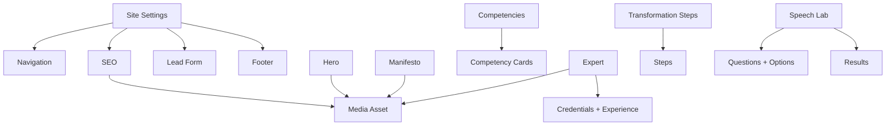

# Контентная модель CMS для Speaker One

Статус: предлагаемая CMS-neutral схема для Stage 10B. В Stage 10A она не подключается к сайту.

## 1. Назначение модели

Модель повторяет существующую страницу и сохраняет контракт компонентов. Она не является свободным page builder: редактор может менять данные внутри утверждённых секций, но не может добавлять, удалять и переставлять секции, редактировать CSS-классы, вставлять HTML/JavaScript или менять логику приложения.

Схема описана независимо от Sanity. Схемы выбранной CMS реализуют те же правила, а адаптер возвращает текущую структуру `CONFIG_CMS`.

## 2. Типы и правила именования

| Тип | Значение |
| --- | --- |
| `singleton<T>` | Документ этого типа существует ровно в одном экземпляре |
| `string` | Однострочный plain text без HTML |
| `text` | Многострочный plain text без HTML |
| `slug` | Стабильный технический ID: латиница, цифры, дефисы |
| `url` | Валидный абсолютный HTTPS URL либо разрешённый internal path/hash |
| `image` | Ссылка на asset с crop/hotspot и metadata |
| `reference<T>` | Ссылка на другой документ/asset |
| `array<T>` | Упорядоченный список со стабильными `_key` |
| `enum` | Одно значение из allow-list |
| `boolean` | Явное да/нет |
| `integer` | Целое число в заданных пределах |

Технические ключи используют английский `camelCase`, подписи и подсказки в админке — понятный русский язык. У элементов массивов есть неизменяемые `_key`, чтобы порядок можно было менять без потери идентичности.

Текст хранится с обычными пробелами. Адаптер при сборке расставляет типографические неразрывные пробелы в коротких русских предлогах/союзах. Редактор не вводит HTML-сущности.

## 3. Карта сущностей

Порядок публичных секций хранится в коде и не редактируется:

1. Hero
2. Manifesto
3. Competencies / Results
4. Expert
5. Speech Lab
6. Transformation Steps
7. Lead Form
8. Footer

Поле `order` изменяет только порядок элементов внутри списка: пунктов меню, карточек, вопросов или этапов.

## 4. Общие объекты

### 4.1 `link`

| Поле | Тип | Обязательно | Правило |
| --- | --- | --- | --- |
| `label` | `string` | Да | 1–60 символов |
| `kind` | `enum(hash, internal, external)` | Да | Определяет способ проверки |
| `href` | `url` | Да | Разрешённый hash/path или absolute HTTPS |
| `openInNewTab` | `boolean` | Да | Для подходящих external links включается автоматически |
| `isVisible` | `boolean` | Да | Скрывает ссылку, но не целевую секцию |
| `ariaLabel` | `string` | Нет | Нужен, если видимая подпись недостаточно понятна |

Разрешённые hashes первого релиза:

- `#about`
- `#features`
- `#expert`
- `#speech-lab`
- `#protocol`
- существующая цель формы, вызываемая через `scrollToForm`

### 4.2 `cta`

| Поле | Тип | Обязательно | Правило |
| --- | --- | --- | --- |
| `label` | `string` | Да | 2–60 символов, preview на 320 px |
| `action` | `enum(scrollToForm, internalLink, externalLink)` | Да | Для основных CTA — `scrollToForm` |
| `href` | `url` | Условно | Только для link-действий |
| `isVisible` | `boolean` | Да | Главный Hero CTA нельзя скрыть в первом релизе |

### 4.3 `mediaAsset`

| Подпись в админке | Ключ | Тип | Обязательно | Правило |
| --- | --- | --- | --- | --- |
| Файл | `asset` | `image` | Да | JPG, PNG, WebP, AVIF; SVG — только Admin brand asset |
| Понятное имя | `title` | `string` | Да | 3–100 символов |
| Alt-текст | `alt` | `string` | Условно | 10–180; пустой только для подтверждённо декоративного изображения |
| Декоративное | `isDecorative` | `boolean` | Да | Нельзя для Hero и фото эксперта |
| Назначение | `usage` | `enum(hero, portrait, section, logo, favicon, og)` | Да | Управляет crop и min-size |
| Фокус кадра | `focalPoint` | hotspot | Желательно | Проверяется во всех требуемых форматах |
| Автор/источник | `credit` | `string` | Нет | Если требуется правообладателем |
| Права подтверждены | `rightsConfirmed` | `boolean` | Да | Admin подтверждает право публикации |
| Комментарий к замене | `replacementNote` | `string` | Нет | Причина и дата замены |

Общие ограничения:

- до 8 МБ на исходное изображение;
- для Hero/OG желательно от 1600 px по длинной стороне;
- удаление запрещено, пока asset используется published/retained версией;
- размеры и современные форматы генерируются image pipeline, а не загружаются как дубликаты.

### 4.4 `publicationMeta`

| Поле | Тип | Кто задаёт | Назначение |
| --- | --- | --- | --- |
| `status` | `enum(draft, published)` | CMS | Состояние публикации |
| `updatedAt` | datetime | CMS | Audit |
| `updatedBy` | user reference | CMS | Audit |
| `reviewNote` | `text` | Редактор | Причина/контекст изменения |
| `previewChecked` | `boolean` | Публикующий | Подтверждение desktop/mobile preview |

## 5. Site Settings

Документ: `singleton<siteSettings>`  
Раздел: **Настройки сайта**  
Доступ: Admin; безопасные social/contact поля могут быть доступны Editor.

| Подпись | Ключ | Тип | Обязательно | Валидация / источник |
| --- | --- | --- | --- | --- |
| Название проекта | `siteName` | `string` | Да | 2–60; единый источник brand/SEO |
| Основной домен | `siteUrl` | `url` | Для production | HTTPS origin без path/query |
| Язык | `language` | `enum(ru)` | Да | В первом релизе фиксирован |
| Локаль | `locale` | `enum(ru_RU)` | Да | В первом релизе фиксирована |
| Полный логотип | `logoFull` | `reference<mediaAsset>` | Да | `usage=logo` |
| Знак логотипа | `logoMark` | `reference<mediaAsset>` | Да | `usage=logo` |
| Favicon | `favicon` | `reference<mediaAsset>` | Да | `usage=favicon`, square |
| Основной контакт | `primaryContact` | `url` | Да | Проверенный Telegram/другой HTTPS-канал |
| Политика | `privacyPolicyUrl` | `url` | Да | Working internal path или HTTPS |
| Социальные ссылки | `socialLinks` | `array<socialLink>` | Нет | По одной на сеть, без placeholders |
| Реквизиты | `legal` | `legalDetails` | Да | Admin only |
| Endpoint формы | `leadEndpoint` | `url` | Условно | Admin only; HTTPS + host allow-list; отдельный settings boundary при Contributor |
| Источник заявки | `leadSource` | `string` | Да | Изначально `speaker-one-website` |
| Индексация | `indexingMode` | `enum(production, noindex)` | Да | Production требует реальный domain |
| Фон | `backgroundPreset` | `enum(current)` | Да | В первой CMS заблокирован на current |

`socialLink`: `network` (`telegram`, `vkontakte`, `youtube`, `dzen`), `label`, `url`, `isVisible`. Дубликаты видимой сети запрещены.

`legalDetails`:

| Поле | Тип | Обязательно | Валидация |
| --- | --- | --- | --- |
| `entityType` | `enum(individualEntrepreneur)` | Да | Текущий тип |
| `ownerFullName` | `string` | Да | 5–150 |
| `inn` | `string` | Да | Ровно 12 цифр для текущего ИП |
| `ogrnip` | `string` | Да | Ровно 15 цифр |
| `privacyPolicyUrl` | `url` | Да | Одна ссылка для формы и Footer |

Адрес, телефон, email и часы работы не создаются, пока нет реальных утверждённых данных.

## 6. Accessibility и системные подписи

Вложенный объект `accessibility` в Site Settings:

| Подпись | Ключ | Обязательно | Максимум |
| --- | --- | --- | --- |
| Переход к основному содержанию | `skipToContent` | Да | 80 |
| Название основной навигации | `mainNavigationLabel` | Да | 80 |
| Название Footer для скринридера | `footerLabel` | Да | 100 |

Месяцы и другие locale primitives остаются в `Intl`/коде и не редактируются владельцем.

## 7. Navigation

Документ: `singleton<navigation>`  
Раздел: **Навигация**

| Подпись | Ключ | Тип | Обязательно | Валидация |
| --- | --- | --- | --- | --- |
| Пункты меню | `items` | `array<navigationItem>` | Да | 1–8; unique approved hash |
| Портфолио | `portfolio` | `link` | Да | External HTTPS; label 2–40 |
| Кнопка консультации | `consultationCta` | `cta` | Да | Action фиксирован `scrollToForm` |

`navigationItem`: `label` (1–30), `href` (allow-list hash), `order` (10–1000), `isVisible`, optional `ariaLabel`. Порядок пунктов не влияет на порядок секций и их IDs.

## 8. Hero

Документ: `singleton<hero>`  
Раздел: **Hero — первый экран**  
Документ всегда существует и видим.

| Подпись | Ключ | Тип | Обязательно | Максимум | Текущий target |
| --- | --- | --- | --- | --- | --- |
| Верхняя подпись | `eyebrow` | `string` | Да | 100 | `hero.tagline` |
| Первая строка заголовка | `titleMain` | `string` | Да | 90 | `hero.titleMain` |
| Акцентная строка | `titleAccent` | `string` | Да | 100 | `hero.titleItalic` |
| Подзаголовок | `subtitle` | `text` | Да | 180 | `hero.subtitle` |
| Описание | `description` | `text` | Да | 500 | `hero.description` |
| Главная кнопка | `primaryCta` | `cta` | Да | 60 | `hero.primaryCta` |
| Подпись под кнопкой | `ctaNote` | `text` | Да | 220 | `hero.ctaNote` |
| Фотография | `image` | `reference<mediaAsset>` | Да | Hero crop | `media.expertHeroBg` |
| Подпись основателя | `founderLabel` | `string` | Да | 80 | `hero.expertRole` |
| Имя эксперта | `expertName` | shared reference | Да | 80 | Expert name |
| Роль | `expertRole` | `text` | Да | 180 | `hero.proofPoints[0]` |

Перед публикацией проверяются 320, 375, 1024, 1440 и 1920 px: отсутствие overflow, CTA, читаемость и лицо в кадре.

## 9. Manifesto / Философия

Документ: `singleton<manifesto>`

| Подпись | Ключ | Тип | Обязательно | Максимум | Текущий target |
| --- | --- | --- | --- | --- | --- |
| Верхняя подпись | `eyebrow` | `string` | Да | 100 | `manifesto.sectionTitle` |
| Заголовок | `heading` | `string` | Нет | 120 | Не рендерится без отдельного одобрения |
| Основная мысль | `lead` | `text` | Да | 420 | `manifesto.quote` |
| Пояснение | `body` | `text` | Да | 700 | `manifesto.mainText` |
| Дополнительный текст | `secondaryBody` | `text` | Нет | 500 | Не рендерится без поддержки компонента |
| Фотография | `image` | asset reference | Да | `usage=section` | `media.expertAboutCard` |
| CTA | `cta` | `cta` | Да | `scrollToForm` | `manifesto.ctaLabel` |

Future-safe optional поля не должны сами создавать новый публичный элемент.

## 10. Competencies / Results

Документ: `singleton<competencies>`  
Раздел: **Компетенции и результаты**  
Текущий config target: `results`.

| Подпись | Ключ | Тип | Обязательно | Валидация |
| --- | --- | --- | --- | --- |
| Верхняя подпись | `eyebrow` | `string` | Да | До 100 |
| Заголовок | `heading` | `string` | Да | До 140 |
| Описание | `description` | `text` | Нет | До 400; не рендерится без поддержки |
| Карточки | `cards` | `array<competencyCard>` | Да | Ровно 3 active для текущего layout |
| Подпись даты | `todayLabel` | `string` | Да | До 30 |

`competencyCard`: `slug` (unique, stable), `title` (5–100), `description` (40–420), `metrics` (1–3 строки по 2–80), `order` (unique), `isVisible`. На первом релизе все три карточки обязательны и видимы. Адаптер переводит список в существующие `card1*`, `card2*`, `card3*`.

## 11. Expert

Документ: `singleton<expert>`

| Подпись | Ключ | Тип | Обязательно | Правило |
| --- | --- | --- | --- | --- |
| Верхняя подпись | `eyebrow` | `string` | Да | До 100 |
| Имя | `name` | `string` | Да | 2–80; один источник для Hero/JSON-LD |
| Роль | `role` | `string` | Да | 5–160 |
| Статус основателя | `founderLabel` | `string` | Да | 3–80 |
| Описание подхода | `description` | `text` | Нет | 40–800; только при поддержке текущим UI |
| Фотографии | `images` | `array<media reference>` | Да | Portrait и work, разные alt |
| Факты и регалии | `credentials` | `array<credential>` | Да | Без усиления формулировок |
| Заголовок фактов | `credentialsTitle` | `string` | Да | До 80 |
| Карточки опыта | `experienceCards` | `array<experienceCard>` | Да | Ровно 3 active |
| Заголовок аудитории | `audienceTitle` | `string` | Да | До 100 |
| Для кого | `audienceText` | `text` | Да | 40–500 |
| Telegram CTA | `telegramCta` | `cta` | Да | Проверенная shared ссылка |
| Социальные ссылки | `socialLinks` | references | Нет | Ссылки из Site Settings |

`credential`:

| Поле | Тип | Обязательно | Правило |
| --- | --- | --- | --- |
| `text` | `string` | Да | 5–240, plain text |
| `verificationStatus` | `enum(confirmed, needsConfirmation)` | Да | Internal, не показывается |
| `evidenceNote` | `text` | Для confirmed | Internal ссылка/описание источника |
| `order` | `integer` | Да | Unique |
| `isVisible` | `boolean` | Да | Неподтверждённый факт нельзя усиливать |

В миграции как `needsConfirmation` входят:

- «Лучший эксперт по ораторскому искусству УрФО — 2025»;
- подготовка спикеров к выступлениям перед первыми лицами РФ;
- 2000+ учеников из разных регионов России.

`experienceCard`: `slug`, `label` (2–30), `text` (10–180), `order`, `isVisible`. Сохраняются три утверждённые карточки «ПРАКТИКА», «ТРЕНИНГИ», «ЭФИРЫ».

## 12. Transformation Steps

Документ: `singleton<transformationSteps>`  
Текущий target: `steps`.

| Подпись | Ключ | Тип | Обязательно | Валидация |
| --- | --- | --- | --- | --- |
| Верхняя подпись | `eyebrow` | `string` | Да | До 100 |
| Заголовок | `heading` | `string` | Да | До 140 |
| Описание | `description` | `text` | Нет | До 400; не рендерится без поддержки |
| Подпись номера | `itemLabel` | `string` | Да | До 30 |
| Этапы | `items` | `array<step>` | Да | Ровно 6 active |

`step`: `slug` (unique/stable), `number` (`01`–`06`), `title` (3–90), `description` (20–320), unique `order`, `isVisible` (в первом релизе true).

## 13. Speech Lab

Документ: `singleton<speechLab>`  
Механика фиксирована: 4 вопроса, один ответ, сумма integer points, выбор результата по убывающим `minScore`.

### Поля секции

| Подпись | Ключ | Тип | Обязательно | Валидация |
| --- | --- | --- | --- | --- |
| Фотография | `image` | media reference | Да | Unique alt |
| Верхняя подпись | `eyebrow` | `string` | Да | До 100 |
| Заголовок | `heading` | `string` | Да | До 140 |
| Описание | `description` | `text` | Да | До 500 |
| «Ситуация» | `situationLabel` | `string` | Да | До 40 |
| Завершение | `completedLabel` | `string` | Да | До 80 |
| Aria-label прогресса | `progressAriaLabel` | `string` | Да | До 100 |
| Кнопка назад | `backLabel` | `string` | Да | До 30 |
| Номера вариантов | `optionLabels` | `array<string>` | Да | Ровно 3 unique |
| Вопросы | `questions` | `array<speechQuestion>` | Да | Ровно 4 active |
| Подпись результата | `resultEyebrow` | `string` | Да | До 100 |
| Подпись рекомендации | `recommendationLabel` | `string` | Да | До 80 |
| Результаты | `results` | `array<speechResult>` | Да | Ровно 3 active ranges |
| Заголовок CTA | `ctaTitle` | `string` | Да | До 140 |
| Описание CTA | `ctaDescription` | `text` | Да | До 400 |
| Кнопка консультации | `resultCta` | `cta` | Да | `scrollToForm` |
| Повторить | `resetLabel` | `string` | Да | До 50 |
| Активность | `isActive` | `boolean` | Да | В первом релизе locked true |

`speechQuestion`: unique `slug`, `title` (3–80), `prompt` (20–320), ровно 3 `options`, `order` 1–4, `isActive`.

`speechOption`: `text` (20–360), `points` (Admin-only integer 0–2 на первом релизе), `order` 1–3, `isActive=true`. В админке поясняется, что это не научный/медицинский балл.

`speechResult`:

| Поле | Тип | Обязательно | Валидация |
| --- | --- | --- | --- |
| `slug` | `slug` | Да | Unique/stable |
| `minScore` | `integer` | Да | Admin-only, ranges по убыванию |
| `title` | `string` | Да | 5–120 |
| `description` | `text` | Да | 40–500 |
| `recommendation` | `text` | Да | 40–500 |
| `order` | `integer` | Да | Highest threshold first |
| `isActive` | `boolean` | Да | Ровно 3 active |

Cross-validation вычисляет min/max score из options. Пороги покрывают каждый возможный total ровно одним результатом; lowest threshold не выше минимального score. Текущие пороги 7, 4 и 0 сохраняются до полного пересмотра диагностики.

Запрещены диагнозы, проценты без методики, оценка интеллекта и научные обещания. Ответы пользователя не сохраняются и не передаются вместе с заявкой.

## 14. Lead Form

Документ: `singleton<leadForm>`  
Поля и submission logic остаются в коде; CMS управляет утверждёнными текстами и bounded limits.

### Видимые тексты

| Подпись | Ключ | Тип | Обязательно | Максимум |
| --- | --- | --- | --- | --- |
| Верхняя подпись | `eyebrow` | `string` | Да | 60 |
| Заголовок | `heading` | `string` | Да | 120 |
| Описание | `description` | `text` | Да | 400 |
| Три поля | `fields` | fixed object | Да | Ключи `name`, `contact`, `message` |
| Текст до policy link | `legalPrefix` | `text` | Да | 300 |
| Подпись policy link | `legalLinkLabel` | `string` | Да | 100 |
| Текст после ссылки | `legalSuffix` | `string` | Да | 20 |
| Кнопка | `submitLabel` | `string` | Да | 60 |
| Отправка | `submittingLabel` | `string` | Да | 40 |
| Telegram CTA | `telegramLabel` | `string` | Да | 60 |
| Сообщения состояний | `messages` | fixed object | Да | Каждое 20–400 |
| Ошибки полей | `validationMessages` | fixed object | Да | Каждая 5–240 |

Каждое поле содержит `label`, `placeholder`, `hint`, `minLength`, `maxLength`; добавлять/удалять поля нельзя.

| Поле | Текущий min/max | Допустимая настройка CMS | Правило |
| --- | --- | --- | --- |
| `name` | 2 / 80 | min 1–10, max 40–120 | `min < max`, Admin-only |
| `contact` | 3 / 120 | min 1–20, max 60–160 | Без жёсткой regex телефона/Telegram |
| `message` | 5 / 1000 | min 1–50, max 300–2000 | Server validation не слабее |

`messages` имеет фиксированные ключи `success`, `error`, `unavailable`, `validation`. CMS-текст не меняет правило: success показывается только после подтверждённого `{ "ok": true }`.

`leadEndpoint` хранится один раз в Site Settings и показывается в разделе формы read-only. Это HTTPS server function, не Telegram Bot API. Bot token, chat ID, CRM key и rate-limit secret никогда не становятся CMS-полями.

## 15. Footer

Документ: `singleton<footer>`

| Подпись | Ключ | Тип | Обязательно | Правило |
| --- | --- | --- | --- | --- |
| Название бренда | `brandName` | `string` | Да | До 60 |
| Описание | `description` | `text` | Да | До 500 |
| Заголовок навигации | `navigationTitle` | `string` | Да | До 60 |
| Ссылки | `navigationLinks` | `array<link>` | Да | 1–8, текущие targets |
| Заголовок каналов | `socialTitle` | `string` | Да | До 80 |
| Соцсети | `socialLinks` | references | Нет | Из Site Settings |
| Копирайт | `copyrightText` | `string` | Да | До 160; год генерирует код |
| Статусная подпись | `statusLabel` | `string` | Да | До 100 |
| Реквизиты | `legal` | reference | Да | Один источник Site Settings |
| Политика | `privacyPolicy` | reference | Да | Одна shared ссылка |

Декоративные разделители не являются полями. ИНН/ОГРНИП хранятся цифрами и форматируются адаптером.

## 16. SEO

Документ: `singleton<seo>`  
Раздел: **SEO и публикация**

| Подпись | Ключ | Тип | Обязательно | Валидация |
| --- | --- | --- | --- | --- |
| SEO title | `title` | `string` | Да | Рекомендовано 45–65, hard max 70 |
| Meta description | `description` | `text` | Да | Рекомендовано 130–165, hard max 180 |
| Canonical | reference | `siteSettings.siteUrl` | Да | Не дублируется |
| OG title | `openGraph.title` | `string` | Да | 20–95, default SEO title |
| OG description | `openGraph.description` | `text` | Да | 50–200, default SEO description |
| OG image | `openGraph.image` | media reference | Да | `usage=og`, preview 1200×630 |
| OG type | `openGraph.type` | `enum(website)` | Да | Fixed |
| OG locale | reference | locale | Да | Derived `ru_RU` |
| Twitter card | `twitter.card` | `enum(summary_large_image)` | Да | Fixed |
| Twitter title/description/image | overrides | Нет | По умолчанию из OG |
| Автор | `author` | reference | Да | Expert name/role |
| Организация | `organization` | derived object | Да | Site/legal/logo/verified socials |
| Услуга | `service` | object | Да | Name/type/description без ratings/prices |
| Индексировать | `robots.index` | `boolean` | Да | Только production |
| Follow links | `robots.follow` | `boolean` | Да | Обычно true |
| Домен sitemap | reference | `siteUrl` | Да | Generated |

Editor не вводит raw JSON-LD, robots text или XML. `Organization`, `Person`, `Service` строятся из проверенных данных. FAQ, Review, Rating, address, phone, email и цены не добавляются без реальных видимых источников.

## 17. Фон и системные эффекты

В первой CMS текущий фон и pointer-логика остаются в React/CSS. Нельзя вводить gradients, CSS, blur, duration и JavaScript.

Если позже будут одобрены presets, Admin-only объект может содержать только:

| Ключ | Тип | Значения |
| --- | --- | --- |
| `preset` | `enum` | `current` и отдельно протестированные варианты |
| `motionIntensity` | `enum` | `off`, `subtle`, `current`; reduced motion всегда сильнее |
| `enabledOnMobile` | `boolean` | Pointer reaction по умолчанию false |

Этот объект не входит в первый Stage 10B.

## 18. Матрица прав

| Область | Admin | Editor | Viewer |
| --- | --- | --- | --- |
| Тексты секций | Full + publish | Draft edit | Read/preview |
| Навигация | Full + publish | Draft edit | Read |
| Медиа | Upload/replace/delete after checks | Upload/replace draft; без permanent delete | Read |
| Speech Lab copy | Full | Draft edit | Read |
| Speech Lab weights | Full | Read-only | Read-only |
| Form copy | Full | Draft edit | Read |
| Form limits | Bounded edit | Read-only | Read-only |
| Endpoint/source | Full + audit | Hidden/read-only | Hidden |
| Domain/indexing/legal | Full | Read-only | Read-only |
| SEO copy/OG | Full | Draft edit | Read/preview |
| Roles/schema/secrets | Platform Admin | Нет | Нет |
| Publish/delete | Full с confirmation | По утверждённому workflow | Нет |

Это желаемая бизнес-модель. Доступные тарифы Sanity не дают granular document/field restrictions встроенной роли Editor внутри одного проекта:

- один владелец может работать как Administrator, Viewer — только читать;
- на Growth бизнес-роль Editor безопаснее сопоставить с Contributor: он готовит drafts, Admin публикует, а endpoint/system settings находятся в deployment config или отдельном Admin-only project;
- Enterprise custom roles могут реализовать матрицу в одном проекте.

Встроенный Growth Editor может писать и публиковать все документы проекта, поэтому его нельзя использовать, если человека нужно технически ограничить от системных настроек. Скрытие полей в Studio — только UX.

## 19. Cross-document validation

Production build блокируется, если:

- обязательный singleton отсутствует или дублируется;
- Hero не является единственным источником H1;
- IDs/порядок секций отличаются от locked contract;
- нет 3 competency cards, 3 experience cards, 4 Speech Lab questions × 3 answers, 3 results или 6 steps;
- `order`, slug или `_key` дублируются;
- обязательная строка состоит из пробелов;
- в тексте есть script/raw HTML/видимые escape или entities;
- обращения Вы/Ваш/Вам/Вас нарушают утверждённое написание;
- hash не входит в allow-list или external URL не HTTPS;
- в production остаётся placeholder domain/username;
- policy link не проходит link check;
- media не проходит type/size/rights/alt;
- indexing включён без реального domain;
- JSON-LD использует неподтверждённые данные;
- реквизиты не проходят формат;
- отсутствует сообщение любого состояния формы;
- Speech Lab score ranges неполны;
- public output содержит CMS write token, webhook secret, bot token, chat ID или CRM credential.

## 20. Export contract и fallback

Каждая успешная production-сборка создаёт нормализованный JSON:

- `schemaVersion`;
- `contentRevision` и build timestamp;
- публичную часть Site Settings без secrets/evidence notes;
- все published секции;
- resolved asset URLs, dimensions и alt;
- derived SEO;
- checksum.

Адаптер переводит JSON в текущую форму приложения. Fallback использует ту же схему, поэтому его можно тестировать независимо от CMS. Drafts, private editorial metadata, users и персональные данные в public export не входят.

